# Base de Datos de la Heladería “Shikashika”

[](#)
[](#)
[](#)


[](#)

# Sistema de Base de Datos para Heladería "ShikaShika”

## Descripción del proyecto

El proyecto "ShikaShika" es un sistema integral de base de datos diseñado para gestionar una heladería automática que permite a los usuarios personalizar y pedir helados de forma interactiva. Este sistema automatiza el registro de clientes, la selección de ingredientes, la generación de pedidos, el procesamiento de pagos y el control de inventario, garantizando un flujo de trabajo eficiente, escalable y orientado a mejorar la experiencia del usuario.

## Características

- **Heladería Automatizada:** Plataforma única en Bolivia donde el cliente personaliza su helado mediante una interfaz táctil.
- **Gestión Integral:** Registro de clientes, pedidos, ingredientes, pagos e inventario.
- **Personalización Total:** Permite seleccionar sabores, toppings, leches, edulcorantes, etc.
- **Reportes y Estadísticas:** Consulta de ventas diarias, helados más vendidos y seguimiento del stock.

## Requisitos Previos

- Tener instalado un gestor de bases de datos, preferiblemente **MySQL**.
- Conocimientos básicos de SQL y administración de bases de datos.

## Instalación

Clona el repositorio

```bash
git clone https://github.com/GutBla/PROJECT_Base_de_Datos_Heladeria_Shikashika.git
```

Accede al directorio del proyecto

```bash
cd PROJECT_Base_de_Datos_Heladeria_Shikashika
```

## Uso

- **Importación de la Base de Datos:**
Importa la carpeta **`database`** en MySQL. Esta carpeta contiene todos los scripts SQL necesarios para crear la base de datos, insertar datos y ejecutar consultas.
- **Ejecución de Scripts SQL:**
Revisa el contenido de la carpeta **sql** y ejecuta los scripts en el siguiente orden:
    - `schema.sql` (creación de la estructura de la base de datos)
    - `insert_data.sql` (inserción de datos de prueba)
    - `queries.sql` (consultas de ejemplo y funcionales)
- **Configuración:**
Asegúrate de que el entorno MySQL esté correctamente configurado y funcionando

---

## Definición del Problema

El negocio se enfrenta al reto de gestionar de manera eficiente y automatizada el proceso de personalización y pedido de helados. Sin un sistema centralizado, se producen errores en la toma de pedidos, en el procesamiento de pagos, en el control de inventario y en el análisis de ventas, lo cual afecta la experiencia del cliente y la operatividad del negocio. La implementación de esta base de datos busca solucionar estas deficiencias y optimizar la gestión operativa.


## Requisitos del Sistema

### Requisitos Interfaces

- **Clientes:**
Interfaz táctil intuitiva que permite la selección de ingredientes y la realización de pedidos.
- **Administradores:**
Panel de control para la gestión de inventario, monitoreo de pedidos, seguimiento de ventas y generación de reportes.

### Requisitos Funcionales

- **Gestión de Ingredientes:** Se debe permitir la administración completa de los ingredientes (creación, actualización, eliminación). Esto incluye detalles como tipos de ingredientes (toppings, saborizantes, leches, etc.) y el manejo de su inventario.
- **Registro de Pedidos:** Cada pedido de los clientes debe ser almacenado junto con la información de los ingredientes seleccionados para personalizar el helado.
- **Control de Stock:** La base de datos debe monitorear y actualizar las cantidades de ingredientes en tiempo real para asegurar su disponibilidad.
- **Procesamiento de Pagos:** Se debe registrar el estado de cada transacción y
generar reportes para el seguimiento financiero.

### **Requisitos no funcionales**

- **Escalabilidad:** La base de datos debe poder soportar un aumento en la demanda
sin comprometer su rendimiento.
- **Seguridad**: Debe garantizarse la protección de la información personal y financiera mediante encriptación y control de accesos.
- **Rendimiento**: La base de datos debe responder a consultas en menos de 2 segundos bajo carga normal.

### **Otros requisitos**

- **Mantenimiento**: El sistema debe ser fácil de mantener y permitir actualizaciones sin afectar el funcionamiento de la base de datos.
- **Monitorización**: Los administradores deben poder visualizar informes sobre el inventario, transacciones y comportamiento de los clientes.

---

## Normalización

El proceso de normalización se aplicó a dos casos: **ingredientes** y **helados**, con el objetivo de evitar redundancias y mejorar la integridad de la base de datos.

### Primera Forma Normal (1FN)

En esta etapa se aseguró que cada campo de cada tabla contuviera **un solo valor atómico** y se eliminaran los grupos repetitivos. Por ejemplo:

- **Caso Helados:**
Se detectó que ciertos campos (como el de *toppings* en la tabla original) podían contener múltiples valores. Por ello, se separaron dichos valores en registros individuales o se trasladaron a tablas relacionadas.
- **Caso Clientes:**
La tabla de **Clientes** muestra que cada columna (Carnet_identidad, Nombre, Apellido, etc.) almacena un único dato, cumpliendo con la 1FN.

.png)

### Segunda Forma Normal (2FN)

La 2FN requiere que **todos los atributos no clave dependan de la clave primaria completa**. Se identificaron y eliminaron las dependencias parciales, especialmente en tablas que poseían claves compuestas. Por ejemplo:

- **Caso Helados:**
Los atributos relacionados con los ingredientes (*ID_Saborizante, ID_Leche, ID_Edulcorante*) se separaron en tablas distintas (como **Saborizantes**, **Leches** y **Edulcorantes**). De esta forma, cada dato dependía completamente de la clave primaria del helado y no de solo una parte de ella.
- **Caso Pedidos y Pagos:**
La tabla de **Pedidos** usa el campo *ID_pedido* como clave primaria, y todos los datos como *Fecha_hora_pedido* o *Estado_pedido* dependen directamente de este identificador. La tabla de **Pagos** vincula cada pago con su pedido mediante el *ID_pedido*, asegurando que cada atributo esté relacionado por completo con la clave principal (por ejemplo, *ID_pago*).

.png)

### Tercera Forma Normal (3FN)

La 3FN se centra en **eliminar las dependencias transitivas**: ningún atributo no clave debe depender de otro atributo no clave. Se revisaron las tablas para garantizar que cada entidad contenga únicamente información que dependa directamente de su clave primaria. Por ejemplo:

- **Caso HeladosPredefinidos y HeladosPersonalizados:**
En la tabla de **HeladosPredefinidos** se almacenan atributos como *Descripcion*, *Nombre_helado* y *Direccion_imagen* que describen de manera única el helado predefinido, sin repetir información que pueda derivarse de otras entidades.
- **Tablas de Ingredientes y sus derivadas:**
La **Tabla de Ingredientes** junto con las tablas de **Saborizantes**, **Leches**, **Toppings** y **Edulcorantes** se diseñaron de modo que cada dato (por ejemplo, el nombre del saborizante o la dirección de imagen de un topping) se almacene en una única entidad, evitando redundancias.

.png)

---

## Diagramas

### Diseño Relacional (Diagrama Entidad - Relacional)

| **Entidad** | **Atributos (PK: Primary Key, FK: Foreign Key)** | **Relaciones** |
| --- | --- | --- |
| **Pago** | id_pago (PK), total, metodo_pago, id_pedido (FK) | 1:1 Pago Tiene Pedido |
| **Pedido** | id_pedido (PK), fecha_hora_pedido, estado_pedido, id_cliente (FK) | 1:1 Pedido Tiene Pago, N:1 Pedido Realiza Cliente, 1:N Pedido Contiene DetallePedidos |
| **Cliente** | carnet_de_identidad (PK), teléfono, nombre_completo (nombres, apellido_paterno, apellido_materno), correo_electronico | 1:N Cliente Realiza Pedido |
| **DetallePedidos** (Entidad débil) | id_detalle_pedidos (PK), cantidad, id_pedido (FK) | N:1 DetallePedidos Contiene Pedido, 1:N DetallePedidos Contiene Helado |
| **Helado** (Entidad Padre) | id_helado (PK), id_vaso (FK), precio, tipo_helado | 1:1 Helado hereda a HeladosPredefinidos, 1:1 Helado hereda a HeladosPersonalizados, N:N Helado tiene BolaDeHelado, N:N Helado tiene Topping, 1:1 Helado Servido en Vaso |
| **HeladosPredefinidos** (Entidad Hija) | id_helado (PK), nombre_helado, descripcion, direccion_imagen | 1:1 Helado hereda a HeladosPredefinidos |
| **HeladosPersonalizados** | id_helado_personalizado (PK) | 1:1 Helado hereda a HeladosPersonalizados |
| **Vaso** | id_vaso (PK), tamaño, precio, cantidad_disponible, disponibilidad (Atributo derivado) | 1:1 Vaso Servido con Helado |
| **Ingrediente** (Entidad Padre) | id_ingrediente (PK), tipo_ingrediente, direccion_imagen, informacion_uso_por_porcion (cantidad_uso_por_porcion, precio_uso_por_porcion) | 1:1 Ingrediente hereda a Saborizante, 1:1 Ingrediente hereda a Edulcorante, 1:1 Ingrediente hereda a Topping, 1:1 Ingrediente hereda a Leche |
| **Leche** (Entidad Hija) | id_leche (PK), tipo_leche, id_ingrediente (FK) | 1:N Leche Realiza BolaDeHelado, 1:1 Ingrediente hereda a Leche |
| **Saborizante** (Entidad Hija) | id_saborizante (PK), nombre_saborizante, id_ingrediente (FK) | 1:N Saborizante Realiza BolaDeHelado, 1:1 Ingrediente hereda a Saborizante |
| **Edulcorante** (Entidad Hija) | id_edulcorante (PK), tipo_edulcorante, id_ingrediente (FK) | 1:N Edulcorante Realiza BolaDeHelado, 1:1 Ingrediente hereda a Edulcorante |
| **BolaDeHelado** | id_bola_helado (PK), id_saborizante (FK), id_edulcorante (FK), id_leche (FK) | 1:N Edulcorante Realiza BolaDeHelado, N:N Leche Realiza BolaDeHelado |
| **Topping** (Entidad Hija) | id_topping (PK), nombre_topping, tipo_topping, id_ingrediente (FK) | 1:1 Ingrediente hereda a Topping, 1:1 Topping Tiene Helado |

Este diagrama muestra las relaciones entre las principales entidades del sistema (Clientes, Pedidos, Helados, Ingredientes, etc.).

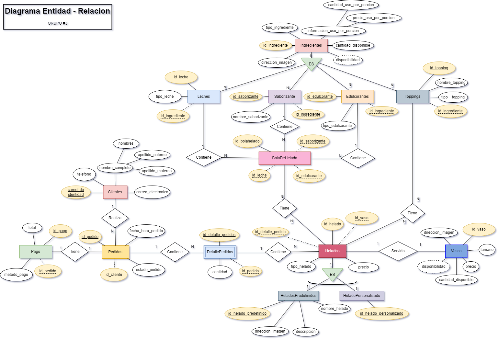

### Diseño Lógico (Modelo Relacional)

| **Tabla** | **Atributos** | **Llaves Foráneas** |
| --- | --- | --- |
| **Pago** | id_pago (INT) NOT NULL AUTO_INCREMENT PRIMARY KEY, metodo_pago (ENUM) NOT NULL, total (DECIMAL(10,2)) NOT NULL, id_pedido (INT) NOT NULL | FOREIGN KEY (id_pedido) REFERENCES Pedidos(id_pedido) |
| **Pedidos** | id_pedido (INT) NOT NULL AUTO_INCREMENT PRIMARY KEY, fecha_hora_pedido (DATETIME) NOT NULL, estado_pedido (ENUM) NOT NULL, id_cliente (INT) NOT NULL | FOREIGN KEY (id_cliente) REFERENCES Clientes(carnet_identidad) |
| **Clientes** | carnet_identidad (INT) NOT NULL PRIMARY KEY, nombres (VARCHAR(25)) NOT NULL, apellido_paterno (VARCHAR(30)) NOT NULL, apellido_materno (VARCHAR(30)) NOT NULL, telefono (INT(11)), correo_electronico (VARCHAR(50)) | — |
| **DetallePedidos** | id_detalle_pedido (INT) NOT NULL AUTO_INCREMENT PRIMARY KEY, cantidad (INT) NOT NULL, id_pedido (INT) NOT NULL | FOREIGN KEY (id_pedido) REFERENCES Pedidos(id_pedido) |
| **Helados** | id_helado (INT) NOT NULL AUTO_INCREMENT PRIMARY KEY, tipo_helado (ENUM) NOT NULL, precio (DECIMAL(10,2)) NOT NULL, id_vaso (INT) NOT NULL | FOREIGN KEY (id_vaso) REFERENCES Vasos(id_vaso) |
| **HeladosPredefinidos** | id_helado_predefinido (INT) NOT NULL AUTO_INCREMENT PRIMARY KEY, nombre_helado (VARCHAR(30)) NOT NULL, descripcion (VARCHAR(60)), direccion_imagen (VARCHAR(100)), id_helado (INT) NOT NULL | FOREIGN KEY (id_helado) REFERENCES Helados(id_helado) |
| **HeladosPersonalizados** | id_helado_personalizado (INT) NOT NULL AUTO_INCREMENT PRIMARY KEY, id_helado (INT) NOT NULL | FOREIGN KEY (id_helado) REFERENCES Helados(id_helado) |
| **Vasos** | id_vaso (INT) NOT NULL AUTO_INCREMENT PRIMARY KEY, tamaño (VARCHAR(10)) NOT NULL, precio (DECIMAL(10,2)) NOT NULL, cantidad_disponible (INT) NOT NULL | — |
| **Ingredientes** | id_ingrediente (INT) NOT NULL AUTO_INCREMENT PRIMARY KEY, tipo_ingrediente (ENUM) NOT NULL, cantidad_disponible (INT) NOT NULL, precio_uso_por_porcion (DECIMAL(10,2)) NOT NULL, direccion_imagen (VARCHAR(100)) NOT NULL | — |
| **HeladosToppings** | id_helado (INT) NOT NULL, id_topping (INT) NOT NULL | FOREIGN KEY (id_helado) REFERENCES Helados(id_helado), FOREIGN KEY (id_topping) REFERENCES Toppings(id_topping) |
| **Toppings** | id_topping (INT) NOT NULL AUTO_INCREMENT PRIMARY KEY, nombre_topping (VARCHAR(30)) NOT NULL, id_ingrediente (INT) NOT NULL, tipo_topping (VARCHAR(30)) NOT NULL | FOREIGN KEY (id_ingrediente) REFERENCES Ingredientes(id_ingrediente) |
| **Edulcorantes** | id_edulcorante (INT) NOT NULL AUTO_INCREMENT PRIMARY KEY, nombre_edulcorante (VARCHAR(30)) NOT NULL, id_ingrediente (INT) NOT NULL | FOREIGN KEY (id_ingrediente) REFERENCES Ingredientes(id_ingrediente) |
| **Saborizantes** | id_saborizante (INT) NOT NULL AUTO_INCREMENT PRIMARY KEY, nombre_saborizante (VARCHAR(30)) NOT NULL, id_ingrediente (INT) NOT NULL | FOREIGN KEY (id_ingrediente) REFERENCES Ingredientes(id_ingrediente) |
| **Leches** | id_leche (INT) NOT NULL AUTO_INCREMENT PRIMARY KEY, tipo_leche (VARCHAR(30)) NOT NULL, id_ingrediente (INT) NOT NULL | FOREIGN KEY (id_ingrediente) REFERENCES Ingredientes(id_ingrediente) |
| **BolaDeHelado** | id_bola_helado (INT) NOT NULL AUTO_INCREMENT PRIMARY KEY, id_leche (INT) NOT NULL, id_saborizante (INT) NOT NULL, id_edulcorante (INT) NOT NULL | FOREIGN KEY (id_leche) REFERENCES Leches(id_leche), FOREIGN KEY (id_saborizante) REFERENCES Saborizantes(id_saborizante), FOREIGN KEY (id_edulcorante) REFERENCES Edulcorantes(id_edulcorante) |
| **HeladosBolasHelado** | id_helado (INT) NOT NULL, id_bola_helado (INT) NOT NULL | FOREIGN KEY (id_helado) REFERENCES Helados(id_helado), FOREIGN KEY (id_bola_helado) REFERENCES BolaDeHelado(id_bola_helado) |

Describe la estructura de las tablas, sus atributos, claves primarias y foráneas para asegurar la integridad referencial.

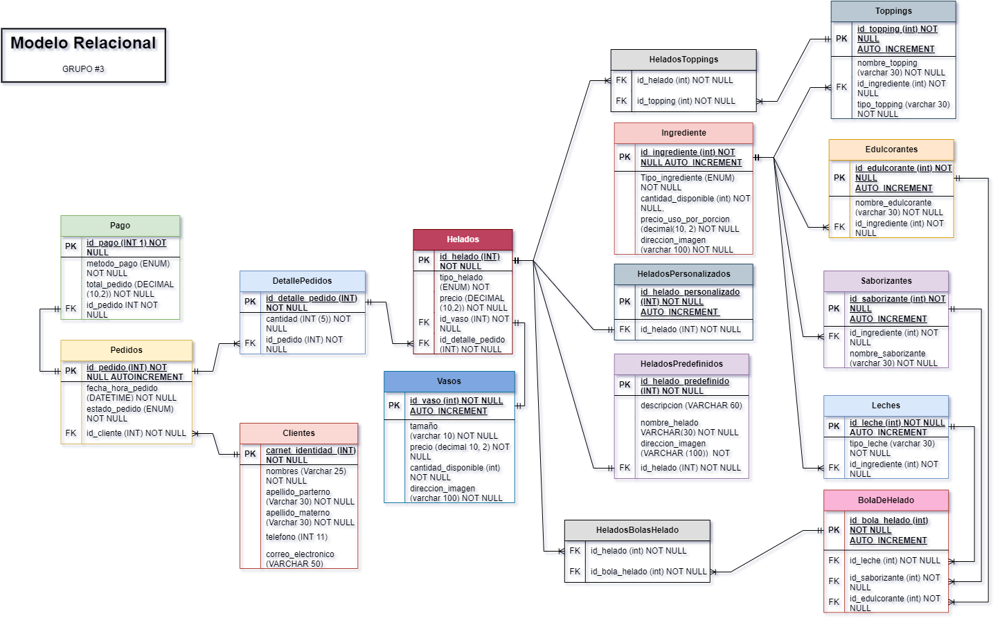

### Diseño Físico

**Tabla de Clientes**

| Carnet_identidad | Nombre | Apellido_paterno | Apellido_materno | Telefono | Correo_electronico |
| --- | --- | --- | --- | --- | --- |
| 123456 | Elena | Mendoza | Torres | 1234567 | elena.mendoza@gmail.com |
| 1234567 | Juan | Pérez | García | 12345678 | juan.perez@gmail.com |
| 2345678 | María | López | Fernández | 23456789 | maria.lopez@gmail.com |
| 3456789 | Carlos | Gómez | Hernández | 34567890 | carlos.gomez@gmail.com |
| 4567890 | Ana | Martínez | Rodríguez | 45678901 | ana.martinez@gmail.com |
| . . . | . . . | . . . | . . . | . . . | . . . |

**Tabla de Clientes**

| ID_pedido | Fecha_hora_pedido | ID_cliente | Estado_pedido |
| --- | --- | --- | --- |
| 1 | 2024-09-15 14:30:00 | ENTREGADO | 1234567 |
| 2 | 2024-09-16 10:15:00 | CANCELADO | 2345678 |
| 3 | 2024-09-17 16:45:00 | EN PROCESO | 3456789 |
| 4 | 2024-09-18 13:00:00 | ENTREGADO | 4567890 |
| 5 | 2024-09-19 18:30:00 | ENTREGADO | 5678901 |
| 6 | 2024-09-20 11:20:00 | CANCELADO | 6789012 |
| 7 | 2024-09-21 09:05:00 | EN PROCESO | 7890123 |
| 8 | 2024-09-22 15:40:00 | ENTREGADO | 8901234 |
| . . . | . . . | . . . | . . . |

**Tabla de Pagos**

| ID_pago | ID_pedido | Metodo_pago | Total_pedido |
| --- | --- | --- | --- |
| 1 | Tarjeta de crédito | 20.00 | 1 |
| 2 | Efectivo | 25.50 | 2 |
| 3 | Tarjeta de débito | 15.00 | 3 |
| 4 | Transferencia | 30.75 | 4 |
| 5 | Efectivo | 18.90 | 5 |
| . . . | . . . | . . . | . . . |

**Tabla de Detalle Pedidos**

| ID_detalle_pedido | Cantidad | ID_pedido,cantidad |
| --- | --- | --- |
| 1 | 1 | 1 |
| 2 | 5 | 1 |
| 3 | 2 | 2 |
| 4 | 6 | 2 |
| 5 | 3 | 3 |
| . . . | . . . | . . . |

**Tabla de Detalle Pedidos**

| ID_vaso | Tamaño | Precio | Cantidad_disponible | Direccion_imagen |
| --- | --- | --- | --- | --- |
| 1 | Pequeño | 3.50 | 100 | /img/vaso_pequeño.png |
| 2 | Mediano | 4.00 | 200 | /img/vaso_mediano.png |
| 3 | Grande | 4.50 | 150 | /img/vaso_grande.png |

**Tabla de Detalle Helados**

| ID_helado | Tipo_helado | ID_vaso | ID_detalle_pedido | Precio |
| --- | --- | --- | --- | --- |
| 1 | PREDEFINIDO | 3.50 | 1 | 1 |
| 2 | PERSONALIZADO | 5.45 | 2 | 2 |
| 3 | PREDEFINIDO | 3.50 | 3 | 3 |
| 4 | PERSONALIZADO | 7.12 | 1 | 4 |
| 5 | PREDEFINIDO | 6.17 | 2 | 5 |
| . . . | . . . | . . . | . . . | . . . |

**Tabla de Ingredientes**

| ID_ingrediente | Tipo_ingrediente | Cantidad_disponible | Precio_uso_por_porcion | Direccion_imagen |
| --- | --- | --- | --- | --- |
| 49 | TOPPING | 70 | 0.80 | imagenes/topping16.png |
| 15 | SABORIZANTE | 75 | 0.55 | imagen_cafe.jpg |
| 60 | TOPPING | 75 | 0.80 | imagenes/topping27.png |
| 3 | SABORIZANTE | 80 | 0.55 | imagen_chocolate.jpg |
| 14 | SABORIZANTE | 80 | 0.70 | imagen_pasas_al_ron.jpg |
| 25 | SABORIZANTE | 80 | 0.55 | imagen_calabaza.jpg |
| 41 | TOPPING | 80 | 0.85 | imagenes/topping8.png |
| 71 | TOPPING | 80 | 0.75 | imagenes/topping38.png |
| . . . | . . . | . . . | . . . | . . . |

**Tabla de Saborizantes**

| ID_saborizante | Nombre_saborizante | ID_ingrediente |
| --- | --- | --- |
| 1 | Vainilla | 1 |
| 2 | Fresa | 2 |
| 3 | Chocolate | 3 |
| 4 | Coco | 4 |
| 5 | Menta | 5 |
| 6 | Limon | 6 |
| . . . | . . . | . . . |

**Tabla de Leches**

| ID_leche | Leche Natural | 26 |
| --- | --- | --- |
| 1 | Leche Natural | 26 |
| 2 | Leche Deslactosada | 27 |
| 3 | Leche Light | 28 |
| 4 | Leche Descremada | 29 |
| . . . | . . . | . . . |

**Tabla de Toppings**

| ID_leche | nombre_edulcorante | Tipo_Toping | id_ingrediente |
| --- | --- | --- | --- |
| 1 | Almendras | sólido | 34 |
| 2 | Arándano | sólido | 35 |
| 3 | Castañas | sólido | 36 |
| 4 | Chips de colores | sólido | 37 |
| . . . | . . . | . . . | . . . |

**Tabla de Edulcorantes**

| ID_edulcorantes | nombre_edulcorante | 72 |
| --- | --- | --- |
| 1 | Azucar | 72 |
| 2 | Stevia | 73 |
| 3 | Azucar Monera | 74 |
| . . . | . . . | . . . |

**Tabla de  HeladosPersonalizados**

| ID_HeladosPersonalizados | id_helado |
| --- | --- |
| 1 | 2 |
| 2 | 4 |
| 3 | 6 |
| . . . | . . . |

**Tabla de BolasHelado**

| ID_**BolasHelado** | 1 | 1 | 1 |
| --- | --- | --- | --- |
| 1 | 1 | 1 | 1 |
| 2 | 2 | 2 | 1 |
| 3 | 3 | 3 | 2 |
| 4 | 4 | 4 | 2 |
| . . . | . . . | . . . | . . . |

**Tabla de HeladosPredefinidos**

| ID_HeladosPredefinidos | Descripcion | Nombre_helado | Direccion_imagen | ID_helado |
| --- | --- | --- | --- | --- |
| 1 | Helado intenso de chocolate ... | Choco Explosión | /imagenes/choco.jpg | 1 |
| 2 | Helado cremoso de caramelo ...  | Caramelo Travieso | /imagenes/caramelo_travieso.jpg | 3 |
| 3 | Helado de Oreo con trozos de galletas  ... | Oreo Monstruoso | /imagenes/oreos_monster.jpg | 5 |
| . . . | . . . | . . . | . . . | . . . |

**Tabla de HeladosToppings**

| ID_helado | ID_topping |
| --- | --- |
| 1 | 1 |
| 2 | 2 |
| 2 | 3 |
| 3 | 4 |
| . . . | . . . |

**Tabla de Relaciones**

| Entidad Origen         | Atributo Origen       | Entidad Destino   | Atributo Destino        | Tipo/Comentario                               |
|------------------------|-----------------------|-------------------|-------------------------|-----------------------------------------------|
| Pagos                  | id_pedido             | Pedidos           | id_pedido               | Muchos a 1 (clave foránea)                    |
| Pedidos                | id_cliente            | Clientes          | carnet_identidad        | Muchos a 1 (cada pedido pertenece a un cliente)|
| DetallePedidos         | id_pedido             | Pedidos           | id_pedido               | Muchos a 1                                    |
| Helados                | id_detalle_pedido     | DetallePedidos    | id_detalle_pedido       | Muchos a 1                                    |
| Helados                | id_vaso               | Vasos             | id_vaso                 | Muchos a 1                                    |
| HeladosBolasHelado     | id_helado             | Helados           | id_helado               | Relación intermedia (muchos a muchos)         |
| HeladosBolasHelado     | id_bola_helado        | BolasHelado       | id_bola_helado          | Relación intermedia (muchos a muchos)         |
| HeladosToppings        | id_helado             | Helados           | id_helado               | Relación intermedia (muchos a muchos)         |
| HeladosToppings        | id_topping            | Toppings          | id_topping              | Relación intermedia (muchos a muchos)         |
| HeladosPersonalizados  | id_helado             | Helados           | id_helado               | Relación de extensión (detalle adicional)     |
| HeladosPredefinidos    | id_helado             | Helados           | id_helado               | Relación de extensión (detalle adicional)     |
| Toppings               | id_ingrediente        | Ingredientes      | id_ingrediente          | Muchos a 1                                    |
| Edulcorantes           | id_ingrediente        | Ingredientes      | id_ingrediente          | Muchos a 1                                    |
| Saborizantes           | id_ingrediente        | Ingredientes      | id_ingrediente          | Muchos a 1                                    |
| Leches                 | id_ingrediente        | Ingredientes      | id_ingrediente          | Muchos a 1                                    |
| BolasHelado            | id_leche              | Leches            | id_leche                | Muchos a 1                                    |
| BolasHelado            | id_saborizante        | Saborizantes      | id_saborizante          | Muchos a 1                                    |
| BolasHelado            | id_edulcorante        | Edulcorantes      | id_edulcorante          | Muchos a 1                                    |


Incluye el diagrama de Reverse Engineering.


---

## Interfaz Mockup

### Interfaz de Usuario (Cliente)

Mockups que ilustran la experiencia del usuario en la selección de helados y personalización de ingredientes.


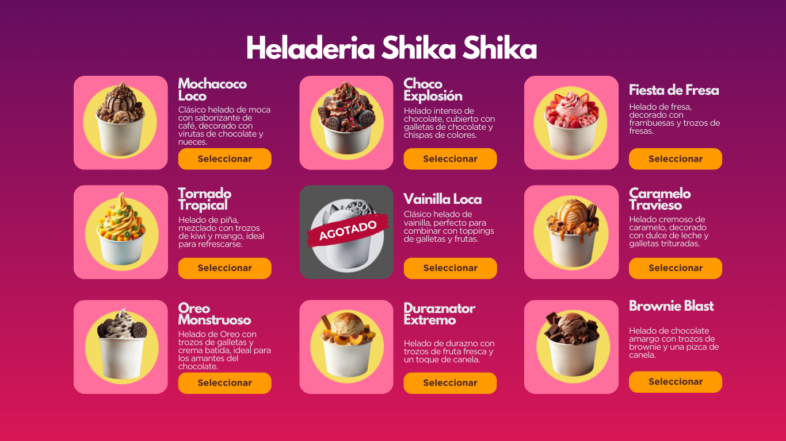


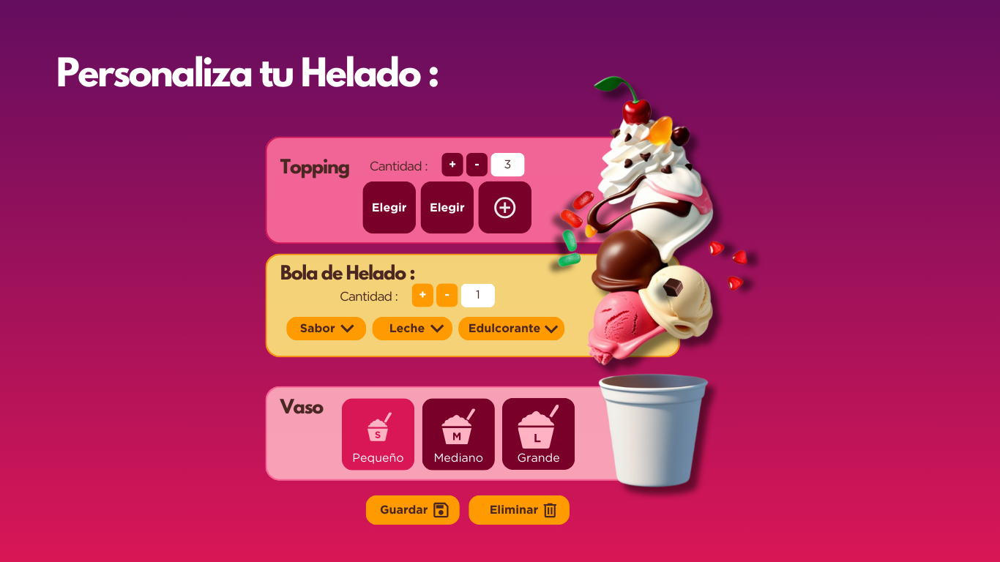

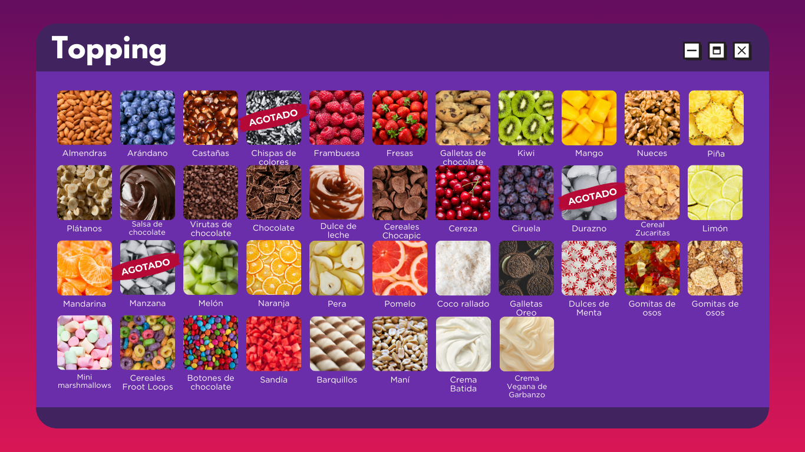

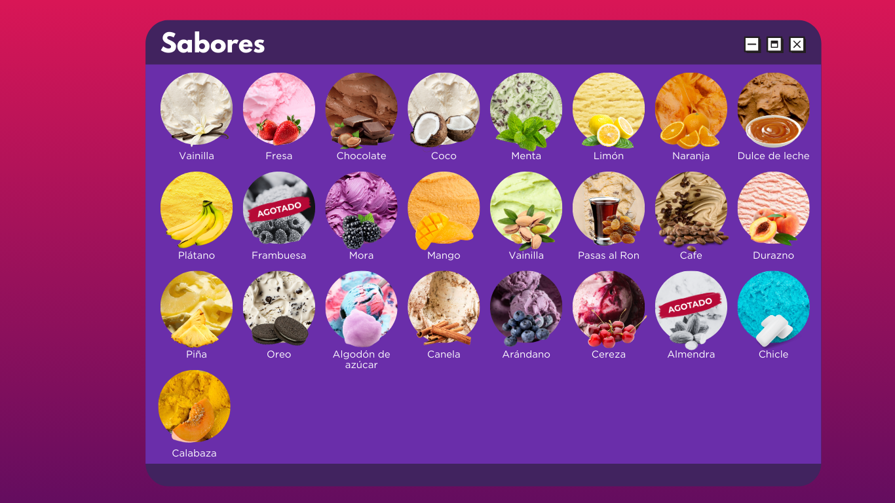

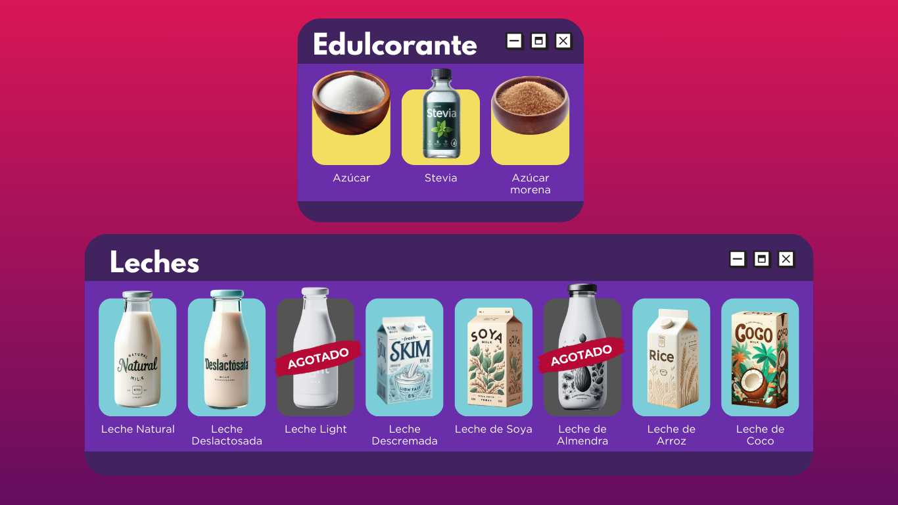

### Interfaz de Usuario (Administrador)

Mockups del panel de control administrativo, mostrando la gestión de inventario, pedidos y generación de reportes.

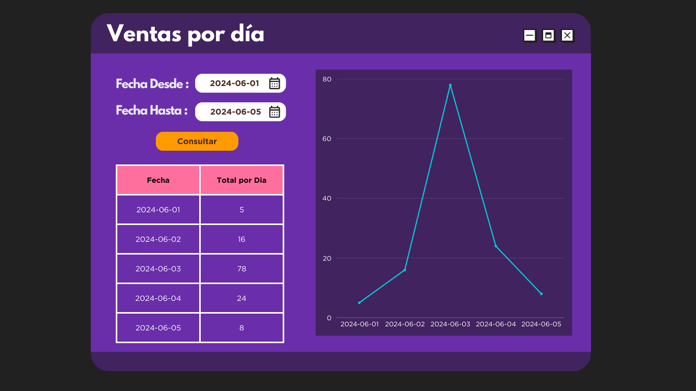

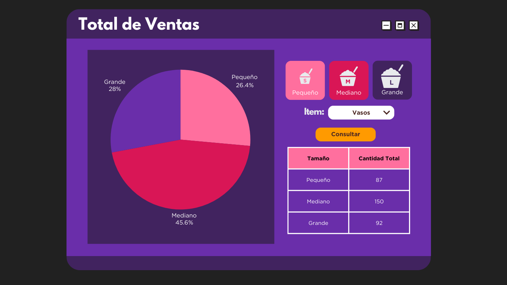

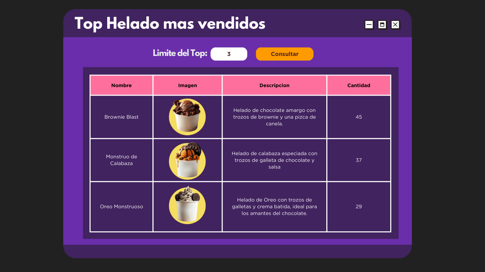

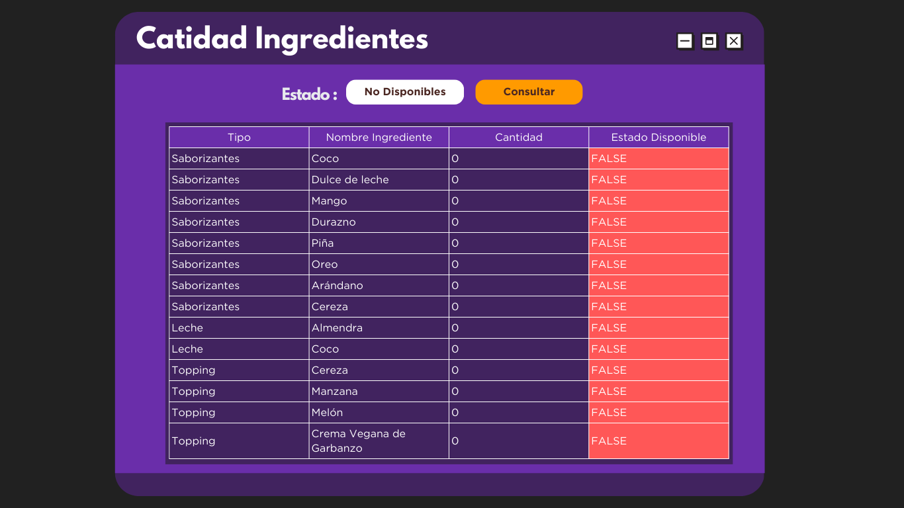

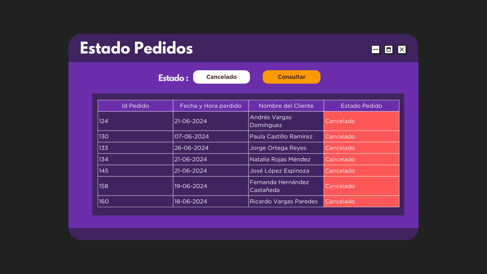

---

## Consultas

Se proporcionan scripts SQL para ejecutar consultas esenciales, entre ellas:

Visualización de helados predefinidos.

```sql
SELECT 
    hp.nombre_helado AS helado,
    hp.direccion_imagen,
    hp.descripcion,
    CASE
        WHEN MIN(ing.cantidad_disponible) > 0 THEN 'Disponible'
        ELSE 'No disponible'
    END AS disponibilidad
FROM HeladosPredefinidos hp
JOIN Helados h ON hp.id_helado = h.id_helado
JOIN HeladosBolasHelado hb ON h.id_helado = hb.id_helado
JOIN BolasHelado bh ON hb.id_bola_helado = bh.id_bola_helado
JOIN Leches l ON bh.id_leche = l.id_leche
JOIN Saborizantes s ON bh.id_saborizante = s.id_saborizante
JOIN Edulcorantes e ON bh.id_edulcorante = e.id_edulcorante
LEFT JOIN HeladosToppings ht ON h.id_helado = ht.id_helado
LEFT JOIN Toppings t ON ht.id_topping = t.id_topping
LEFT JOIN Ingredientes ing ON ing.id_ingrediente = t.id_ingrediente 
    OR ing.id_ingrediente = l.id_ingrediente 
    OR ing.id_ingrediente = s.id_ingrediente 
    OR ing.id_ingrediente = e.id_ingrediente
GROUP BY hp.nombre_helado, hp.direccion_imagen, hp.descripcion;
```

| Choco Explosión | /imagenes/choco.jpg | Helado intenso de chocolate, cubierto con galletas de chocolate y chispas de colores. | Disponible |
| --- | --- | --- | --- |
| Caramelo Travieso | /imagenes/caramelo_travieso.jpg | Helado cremoso de caramelo, decorado con dulce de leche y galletas trituradas. | Disponible |
| Oreo Monstruoso | /imagenes/oreos_monster.jpg | Helado de Oreo con trozos de galletas y crema batida, ideal para los amantes del chocolate. | Disponible |
| Pasas Locas | /imagenes/pasas_locas.jpg | Combinación de pasas al ron con chocolate y un toque de canela. | Disponible |
| Mango Dinamita | /imagenes/mango_dinamita.jpg | Exótico helado de mango, decorado con trozos de frutas tropicales. | Disponible |

Total de ventas por día.

```sql
SELECT DATE(p.fecha_hora_pedido) AS fecha, SUM(pa.total_pedido) AS total_ventas
FROM Pedidos p
JOIN Pagos pa ON p.id_pedido = pa.id_pedido
WHERE p.estado_pedido = 'ENTREGADO'
AND p.fecha_hora_pedido BETWEEN '2024-09-15' AND '2024-09-24'
GROUP BY DATE(p.fecha_hora_pedido);
```

| 2024-09-15 | 20.00 |
| --- | --- |
| 2024-09-18 | 30.75 |
| 2024-09-19 | 18.90 |
| 2024-09-22 | 20.25 |
| 2024-09-23 | 32.40 |

Top 3 helados más vendidos.

```sql
SELECT 
    hp.nombre_helado AS nombre,
    hp.direccion_imagen AS direccion_imagen,
    hp.descripcion AS descripcion,
    COUNT(h.id_helado) AS cantidad_vendidos
FROM Helados h
JOIN HeladosPredefinidos hp ON h.id_helado = hp.id_helado
JOIN DetallePedidos dp ON h.id_detalle_pedido = dp.id_detalle_pedido
JOIN Pedidos p ON dp.id_pedido = p.id_pedido
WHERE p.estado_pedido = 'ENTREGADO'
GROUP BY hp.nombre_helado, hp.direccion_imagen, hp.descripcion
ORDER BY cantidad_vendidos DESC
LIMIT 3;
```

| Choco Explosión | /imagenes/choco.jpg | Helado intenso de chocolate, cubierto con galletas de chocolate y chispas de colores. | 1 |
| --- | --- | --- | --- |
| Pasas Locas | /imagenes/pasas_locas.jpg | Combinación de pasas al ron con chocolate y un toque de canela. | 1 |
| Mango Dinamita | /imagenes/mango_dinamita.jpg | Exótico helado de mango, decorado con trozos de frutas tropicales. | 1 |

Cantidad de ingrediente

```sql
SELECT 
    s.nombre_saborizante AS nombre,
    ing.direccion_imagen,
    CASE
        WHEN ing.cantidad_disponible > 0 THEN 'Disponible'
        ELSE 'No disponible'
    END AS disponibilidad
FROM Saborizantes s
JOIN Ingredientes ing ON s.id_ingrediente = ing.id_ingrediente;

```

| Vainilla | imagen_vainilla.jpg | Disponible |
| --- | --- | --- |
| Fresa | imagen_fresa.jpg | Disponible |
| Chocolate | imagen_chocolate.jpg | Disponible |
| Coco | imagen_coco.jpg | Disponible |
| Menta | imagen_menta.jpg | Disponible |
| Limon | imagen_limon.jpg | Disponible |
| Naranja | imagen_naranja.jpg | Disponible |
| Dulce de leche | imagen_dulce_de_leche.jpg | Disponible |
| Platano | imagen_platano.jpg | Disponible |
| . . .  | . . . | . . . |

Estados del pedido

```sql
SELECT id_pedido, fecha_hora_pedido, id_cliente 
FROM Pedidos 
WHERE estado_pedido = 'CANCELADO';
```

| 20 | 2024-10-10 12:00:00 | Luis Díaz Pérez | CANCELADO |
| --- | --- | --- | --- |
| 16 | 2024-10-06 11:20:00 | Juan Pérez García | CANCELADO |
| 12 | 2024-10-02 10:15:00 | Pedro Romero López | CANCELADO |
| 10 | 2024-09-24 12:00:00 | Elena Mendoza Torres | CANCELADO |
| 6 | 2024-09-20 11:20:00 | Laura Sánchez García | CANCELADO |
| 2 | 2024-09-16 10:15:00 | María López Fernández | CANCELADO |

---

## Ejecución del Proyecto

**Capturas de pantalla de la ejecución de scripts SQL en MySQL.**

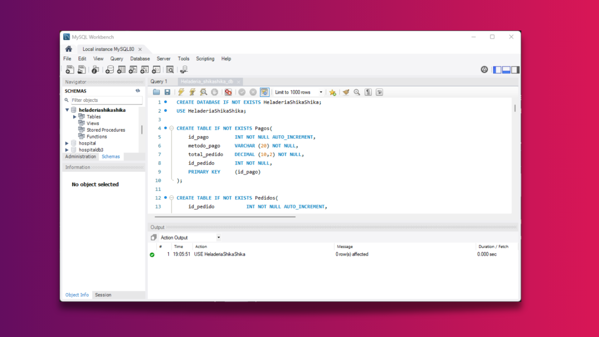

**Aplicación de Reverse Engineering en MySQL.**

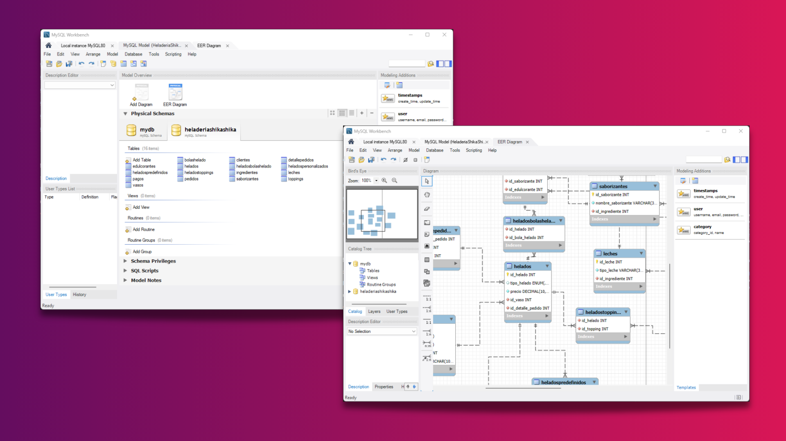

**Evidencias de la interfaz de usuario como cliente.**


**Evidencias de la interfaz de usuario como administrador**

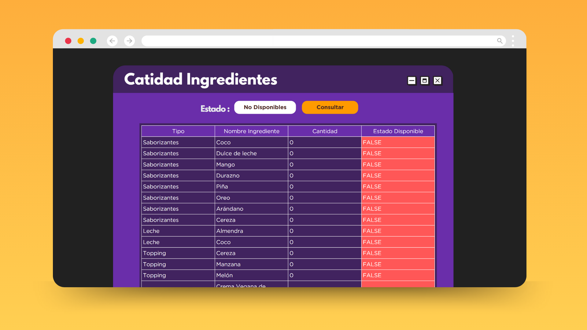